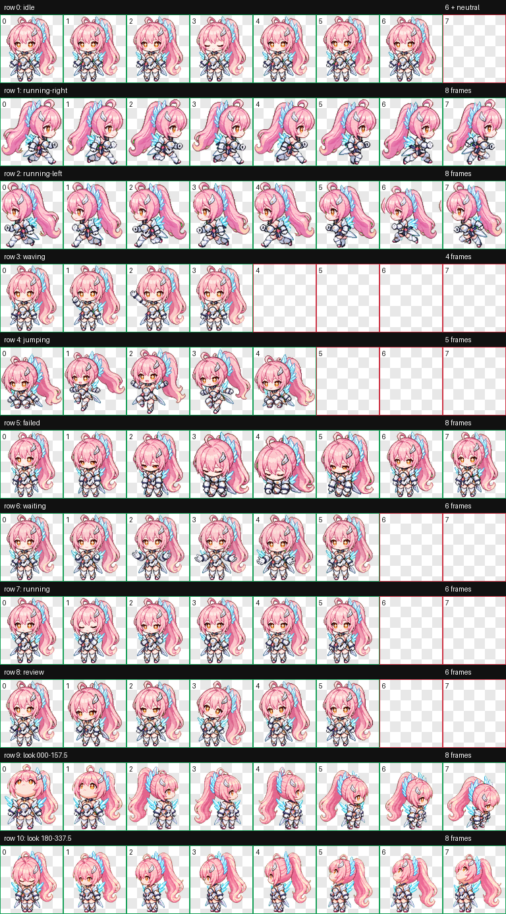

# Aemeath Pixel Pet for Codex

A custom animated Codex pet inspired by Aemeath from *Wuthering Waves*. The design uses a compact pixel-chibi silhouette with a pink ponytail, amber eyes, white armor, and cyan crystalline accents.

This is an unofficial fan-made project and is not affiliated with or endorsed by Kuro Games or OpenAI.



## Features

- Codex v2 sprite format with 11 animation rows
- Standard idle, movement, wave, jump, failure, waiting, working, and review states
- Sixteen clockwise look directions
- Transparent WebP spritesheet
- Validated 1536 × 2288 atlas using 192 × 208 cells

## Installation

Clone or download this repository, then copy it into your local Codex pets directory:

```bash
mkdir -p "${CODEX_HOME:-$HOME/.codex}/pets/aemeath-pixel"
cp pet.json spritesheet.webp \
  "${CODEX_HOME:-$HOME/.codex}/pets/aemeath-pixel/"
```

In the Codex desktop app:

1. Open **Settings → Pets**.
2. Select **Refresh**.
3. Choose **Aemeath Pixel**.
4. Use `/pet` or **Wake Pet** to show it.

The compatible Codex CLI pet picker can be opened with `/pets`. Terminal animation requires a supported graphics protocol such as Kitty, Sixel, or iTerm2 graphics.

## Files

```text
pet.json             Pet metadata and v2 format declaration
spritesheet.webp     Installable animated sprite atlas
validation.json      Deterministic atlas-validation results
qa/                  Contact sheets, direction checks, previews, and QA reports
```

Only `pet.json` and `spritesheet.webp` are required for installation. The validation and QA artifacts are included for review and future maintenance.

## Device and account scope

Custom desktop pets are installed locally and do not automatically sync through a Codex or ChatGPT account. To use this pet on another computer, clone this repository there and repeat the installation steps.

The Codex IDE extension does not currently provide a pet picker or floating pet overlay. Web pet uploads use a different documented format, so this v2 desktop spritesheet should be treated as a desktop/compatible-CLI package.

## Validation

The included atlas passed:

- v2 dimensions and layout validation
- transparency and chroma-edge cleanup
- required-cell and unused-cell checks
- four-cardinal and sixteen-direction semantic review
- three-reviewer blind direction QA
- independent final visual QA

See [`qa/run-summary.json`](qa/run-summary.json) for the packaged QA summary.

## Rights

The original character and *Wuthering Waves* belong to their respective rights holders. This repository contains fan-made derivative artwork intended for personal customization and non-commercial use.
